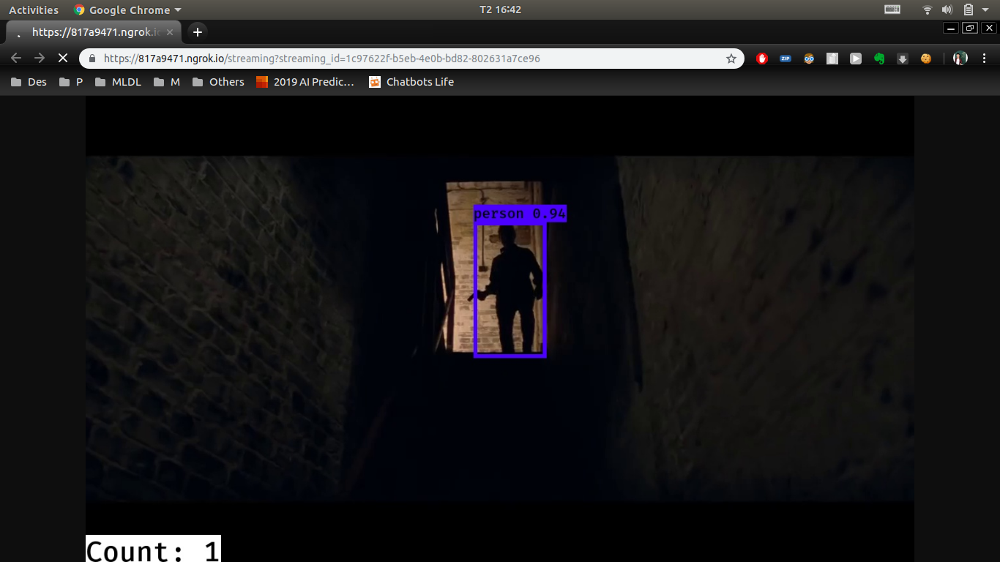

# iot-camera
Using YOLOv3 for person recognition and counting.

## Installing
### Prerequisites
```
cv2
PIL
tensorflow (GPU)
numpy
flask
flask_bootstrap
```

### Download the weight files

#### `yolo.h5`
Follow the steps in this [Repository](https://github.com/qqwweee/keras-yolo3) to download the file.

Add the file to `minh_custom_keras_yolo3/`

#### `weights.28-3.73.hdf5`
Follow the steps in this [Repository](https://github.com/yu4u/age-gender-estimation) to download the file

Add the file to `age_gender_estimation/pretrained_models/`
## Running

### Starting the Flask Server
```
cd api
python api_[version].py
```
The server will automatically run on port 5000

### Using API

#### Proceed 1 image/video

POST Request:
```
curl -X POST -F "file_input=@[FILE_PATH]" -F "output_type=output_file" --output [OUTPUT_FILE_PATH] [BASE_URL]/upload_data
```

#### Streaming
Streaming your video online

Upload video to the server:
```
curl -X POST -F "file_input=@[FILE_PATH]" https://817a9471.ngrok.io/streaming
```
This will return you a `streaming_id`.

GET request:
```
curl [BASE_URL]/streaming?streaming_id=[STREAMING_ID]
```



## Credits
- [qqwweee/keras-yolo3](https://github.com/qqwweee/keras-yolo3)
- [yu4u/age-gender-estimation](https://github.com/yu4u/age-gender-estimation)

